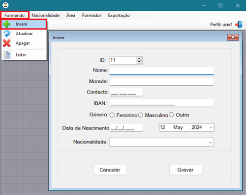
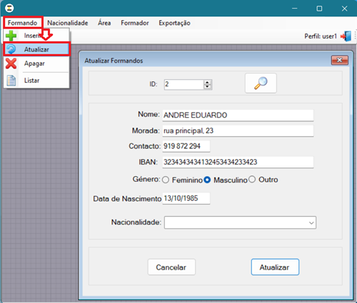
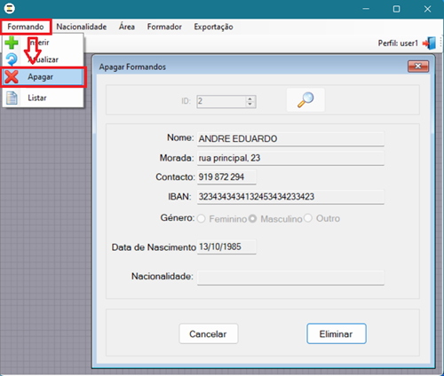
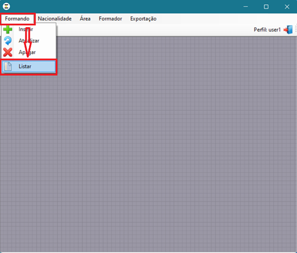
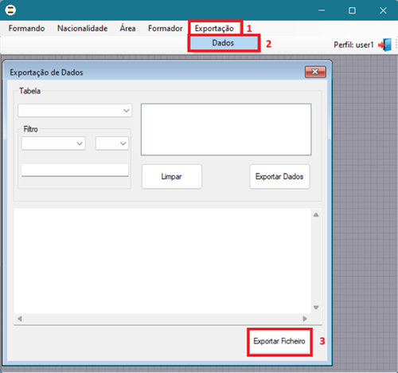

# Manual do Utilizador - Aplicação CRUD 🚀

## Introdução
Bem-vindo ao manual do utilizador da aplicação CRUD para gestão de formandos. 
Este manual providenciará orientações detalhadas sobre como utilizar as funcionalidades 
disponíveis na aplicação.

## Instalação
1. Assegure-se de que o seu computador satisfaz os requisitos mínimos do sistema.
2. Efetue o download do ficheiro de instalação da aplicação.
3. Execute o ficheiro de instalação e siga as instruções apresentadas no ecrã para concluir o processo de instalação.
4. Após a instalação, inicie a aplicação clicando duas vezes no ícone correspondente.

## Autenticação
1. Ao iniciar a aplicação, ser-lhe-á solicitado que efetue o login.
2. Introduza as suas credenciais de utilizador e clique em "Login".
3. Caso não possua uma conta, por favor contacte o administrador do sistema para obter acesso.

## Funcionalidades Principais

### Inserir Formandos
1. No menu principal, clique em  "Formandos" e selecione "Inserir" no submenu.
2. Preencha os campos obrigatórios no formulário de inserção.
3. Clique em "Gravar" para adicionar um novo formando ao sistema.
   
🖊️ 

### Atualizar Formandos
1. No menu principal, clique em "Formandos" e selecione "Atualizar".
2. Pesquise o formando que deseja atualizar ao fornecer o ID do formando.
3. Efetue as alterações necessárias nos campos do formando.
4. Clique em "Atualizar" para aplicar as alterações.
   
🔄 

### Apagar Formandos
1. No menu principal, clique em "Formandos" e selecione "Apagar".
2. Selecione o formando que deseja apagar pesquisando o seu ID.
3. Confirme a exclusão clicando em "Eliminar".
   
❌ 

### Listar Formandos
1. No menu principal, clique em "Formandos" e selecione "Listar".
2. Será apresentada uma lista com todos os formandos registados no sistema.
3. Pode filtrar a sua escolha com base no nome, genero e nacionalidade dos formandos.
4. Tem a opção de guardar os resultados da sua pesquisa em PDF, clicando "Imprimir".
   
📋 

### Exportar Dados
1. No menu principal, clique em "Exportação" e selecione "Dados".
2. Especifique a tabela e as colunas que pretende exportar e clique em "Exportar Dados"
3. Pode aplicar filtros se assim o entender, e clicar novamente "Exportar Dados".
4. Clique em "Exportar Ficheiro" para gerar o ficheiro.
5. Especifique o local onde deseja guardar o ficheiro em formato txt. 

📤 

### Gerir Outras Entidades
- Os procedimentos para gerir outras entidades, como nacionalidades, áreas e formadores, seguem um padrão semelhante aos mencionados acima para gerir formandos.

## Configuração do Servidor 🛠️

Antes de utilizar a aplicação pela primeira vez, é necessário configurar a ligação ao servidor e à base de dados corretamente. Ou, alternativamente, utilizar a versão odbc para configuração.
Este processo de configuração é fundamental para garantir a comunicação adequada entre a aplicação e o servidor.

## Suporte
Se encontrar algum problema ou tiver dúvidas sobre a utilização da aplicação, entre em contacto com o suporte técnico através do email: suporte@gestaoformandos.com.
